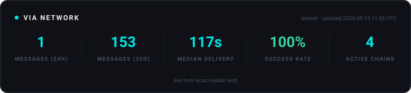

  

**Direct contract-to-contract messaging for any chain, any token, any message.**
Bridge, swap, and connect Web2 to Web3.

 

---

## 🌉 What is VIA?

VIA is universal cross-chain infrastructure: smart contracts on any chain talking directly to contracts on any other — no wrapped hops, no walled gardens. Messages are submitted on a source chain, attested by a decentralized validator set, and delivered on the destination, with every step publicly trackable on [VIA Scan](https://scan.vialabs.tech).

**Currently bridging:** Cardano · Midnight · EVM chains — with more on the way.

## 📊 Live Network Stats

## 🔗 Ecosystem

| | |
|---|---|
| 🌐 **Website** | [vialabs.tech](https://vialabs.tech) |
| 📖 **Documentation** | [developer.vialabs.tech](https://developer.vialabs.tech/) |
| 🔍 **VIA Scan** | [scan.vialabs.tech](https://scan.vialabs.tech) |
| 💬 **Discord** | [Join the community](https://discord.gg/YOUR_INVITE_CODE) |
| 🐦 **X / Twitter** | [@VIA_Labs](https://x.com/VIA_Labs) |

---

© VIA Labs · Universal Cross-Chain Infrastructure

